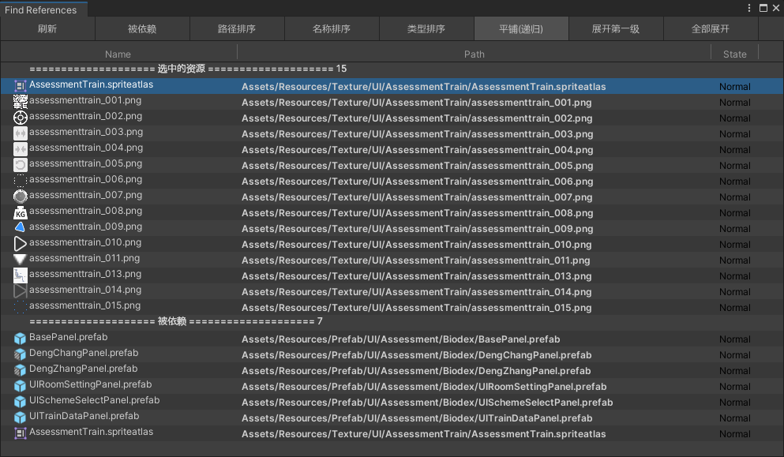

# UnityReferenceFinder
Unity资源引用查找工具，包括依赖和被依赖信息
## 说明
1. 参考 https://github.com/blueberryzzz/ReferenceFinder 实现了一个高效的查找资源文件的依赖信息的工具
2. === 依赖 ===，指的是：该文件依赖的文件（即该文件引用了哪些文件）A 
3. === 被依赖 ===，指的是：哪些文件依赖该文件（即哪些文件引用了该文件）B
4. Unity 的右键 Select Dependencies 指的是 A，没有实现 B
5. Unity2022 提供了右键 Find Reference In Project 功能，本以为实现了 B，实际发现没有卵用
6. 所有的引用信息（依赖和被依赖）缓存在 Library/ReferenceFinderCache 中，可手动刷新，除首次建立引用信息外，查找非常高效
7. 支持树形展示和平铺展示，显示个数
8. 支持按路径、名称、类型，排序
9. 树形展示时，防止出现嵌套（A依赖B，B依赖C，C依赖A 的情况）时造成死循环，出现嵌套时不再向下添加子节点
10. 在平铺展示时，递归查找所有引用（例如：依赖的依赖的依赖...，全部递归查找出来）
## 操作
1. 右键点击一个或多个文件，选择 Find Reference（快捷键为 Alt +Q）
2. 展示的是这些文件依赖的哪些文件，和哪些文件依赖了这些文件
3. 点击条目能直接定位到 Project 视图中的文件
4. 若某个文件有改动，则 State 会显示其状态，点击刷新即可获

   

